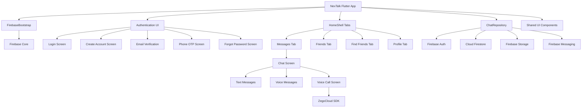
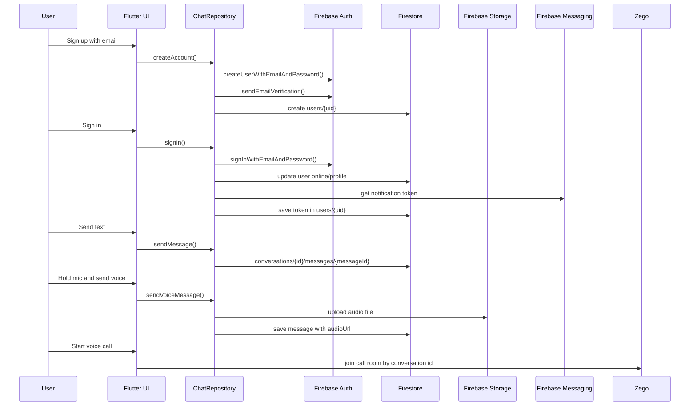
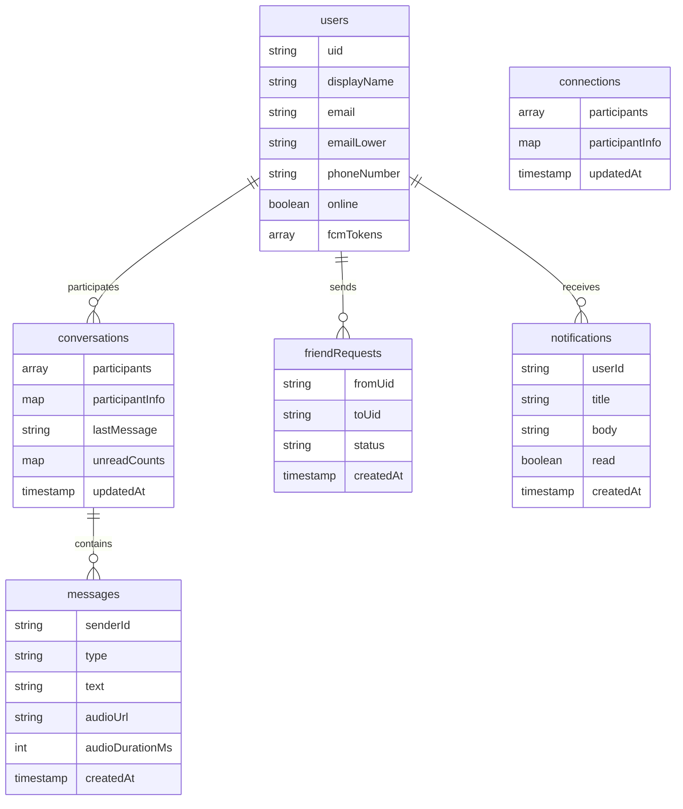
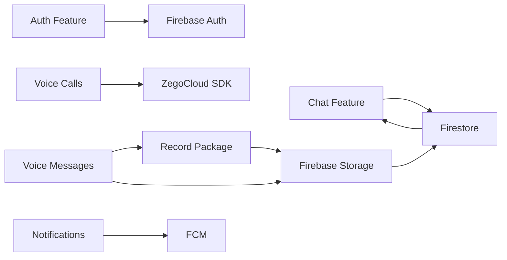

# NexTalk Architecture

This document organizes the current codebase into logical blocks. The app is now split into feature-oriented Dart part files under `lib/src`, while `lib/main.dart` stays small and owns imports, Firebase startup, and `runApp`.

## High-Level Block Diagram



## Data Flow



## Firebase Collections



## Current Code Blocks

| Block | Current Location | Main Classes |
| --- | --- | --- |
| App bootstrap | `lib/main.dart`, `lib/src/app/chat_app.dart`, `lib/src/core/firebase_bootstrap.dart` | `main`, `FirebaseBootstrap`, `ChatApp` |
| Theme/constants | `lib/src/core/theme.dart` | `AppColors`, `ZegoSettings`, `buildTheme` |
| Models | `lib/src/models/models.dart` | `AppUser`, `Conversation`, `ChatMessage`, `FriendRequest`, `AppNotification` |
| Repository/services | `lib/src/services/chat_repository.dart` | `ChatRepository` |
| Utilities/demo data | `lib/src/core/utils.dart`, `lib/src/demo/sample_data.dart` | date formatters, error helpers, sample data |
| Auth screens | `lib/src/features/auth/auth_screens.dart` | `LoginScreen`, `CreateAccountScreen`, `PhoneAuthScreen`, `ForgotPasswordScreen` |
| Main navigation | `lib/src/features/home/home_shell.dart` | `HomeShell` |
| Chat | `lib/src/features/chat/chat_screens.dart` | `MessagesScreen`, `ChatScreen`, `MessageBubble`, `VoiceMessageBubble` |
| Calls | `lib/src/features/chat/chat_screens.dart` | `VoiceCallScreen`, `CallControlButton` |
| Social | `lib/src/features/friends/friends_screens.dart` | `FriendsScreen`, `FindPeopleScreen`, `FriendRequestsScreen` |
| Notifications | `lib/src/features/notifications/notifications_screens.dart` | `NotificationsScreen`, `NotificationCard` |
| Profile | `lib/src/features/profile/profile_screens.dart` | `ProfileScreen`, `ChangePasswordScreen` |
| Shared widgets | `lib/src/shared/widgets.dart` | `AvatarCircle`, `PrimaryButton`, `SearchBox`, `UserCard`, etc. |

## Recommended Folder Structure

```text
lib/
  main.dart
  firebase_options.dart

  src/
    core/
      firebase_bootstrap.dart
      theme.dart
      utils.dart

    models/
      models.dart

    services/
      chat_repository.dart

    demo/
      sample_data.dart

    features/
      auth/
        auth_screens.dart

      home/
        home_shell.dart

      chat/
        chat_screens.dart

      friends/
        friends_screens.dart

      notifications/
        notifications_screens.dart

      profile/
        profile_screens.dart

    shared/
      widgets.dart
```

## Future File Split

The current implementation uses grouped part files to keep the refactor safe. Later, each grouped file can be split into smaller importable files:

```text
lib/features/chat/
  chat_screen.dart
  messages_screen.dart
  widgets/message_bubble.dart
  widgets/voice_message_bubble.dart

lib/shared/
    widgets/avatar_circle.dart
    widgets/buttons.dart
```

## Feature Blocks



## Refactor Order

1. Keep the current part-file structure stable while adding features.
2. Extract grouped part files into importable libraries when a feature becomes too large.
3. Split `ChatRepository` into dedicated auth, chat, storage, notification, and call services.
4. Add tests around each service before splitting repository behavior.
